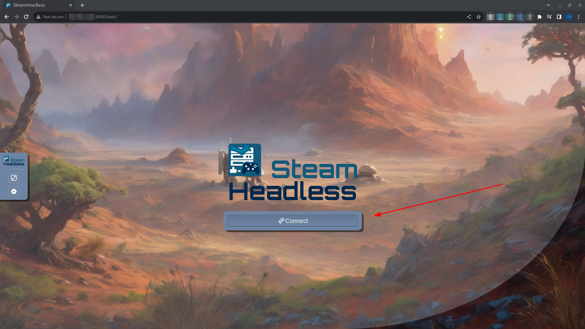

# Docker Compose

Follow these instructions to configure a docker-compose.yml for your system.

> __Note__
>
> These instructions assume that you have docker and docker-compose installed for your system.
> 
> Depending on how you have installed this, the commands to execute docker compose may vary.


## PREPARE DIRECTORIES:

> __Warning__
>
> These commands are meant to be run as your user. Do not run them as root.
> 
> If you do run these commands as root, you may need to manually fix the permissions and ownership after.

Create a directory for your service:
```shell
sudo mkdir -p /opt/container-services/steam-headless
sudo chown -R $(id -u):$(id -g) /opt/container-services/steam-headless
```

Create a directory for your service config data:
```shell
sudo mkdir -p /opt/container-data/steam-headless/{home,.X11-unix,pulse}
sudo chown -R $(id -u):$(id -g) /opt/container-data/steam-headless
```

(Optional) Create a directory for your game install location:
```shell
sudo mkdir /mnt/games
sudo chmod -R 777 /mnt/games
sudo chown -R $(id -u):$(id -g) /mnt/games
```

Create a Steam Headless `/opt/container-services/steam-headless/docker-compose.yml` file.

Populate this file with the contents of the default Docker Compose File

### AMD/Intel:
- [AMD and Intel GPUs](./compose-files/docker-compose.amd+intel.yml).
- [Privileged AMD and Intel GPUs Docker Compose Template](./compose-files/docker-compose.amd+intel.privileged.yml) (grants full access to host devices).

#### Multipl AMD or Intel GPUs

If you have multiple AMD or Intel GPUs and you wish to isolate them, then follow these steps to determine the card to passthrough in the docker compose file. This requires that you do not use the privileged compose template.
1) List the PCI devices and get their IDs `lspci | grep -E 'VGA|3D'`
```
00:02.0 VGA compatible controller: Intel Corporation TigerLake-LP GT2 [Iris Xe Graphics] (rev 01)
06:00.0 VGA compatible controller: Advanced Micro Devices, Inc. [AMD/ATI] Cezanne [Radeon Vega Series / Radeon Vega Mobile Series] (rev c6)
```
In this example, the Intel GPU has an ID of `00:02.0` and the AMD GPU has an ID of `06:00.0`.

2) Discover which `/dev/dri/card*` and `/dev/dri/renderD12*` references the `00:02.0` Intel GPU (or whatever your output was). To do this, run the commands `ls -la /sys/class/drm/card*` and `ls -l /sys/class/drm/renderD*`.
```
lrwxrwxrwx. 1 root root 0 May  8 15:44 /sys/class/drm/card1 -> ../../devices/pci0000:00/0000:00:02.0/drm/card1
lrwxrwxrwx. 1 root root 0 May  8 15:44 /sys/class/drm/card1-DP-1 -> ../../devices/pci0000:00/0000:00:02.0/drm/card1/card1-DP-1
lrwxrwxrwx. 1 root root 0 May  8 15:44 /sys/class/drm/card1-DP-2 -> ../../devices/pci0000:00/0000:00:02.0/drm/card1/card1-DP-2
lrwxrwxrwx. 1 root root 0 May  8 15:44 /sys/class/drm/card1-DP-3 -> ../../devices/pci0000:00/0000:00:02.0/drm/card1/card1-DP-3
lrwxrwxrwx. 1 root root 0 May  8 15:44 /sys/class/drm/card1-DP-4 -> ../../devices/pci0000:00/0000:00:02.0/drm/card1/card1-DP-4
```
```
lrwxrwxrwx. 1 root root 0 May  8 15:44 /sys/class/drm/renderD128 -> ../../devices/pci0000:00/0000:00:02.0/drm/renderD128
lrwxrwxrwx. 1 root root 0 May  8 15:44 /sys/class/drm/renderD129 -> ../../devices/pci0000:00/0000:06:00.0/drm/renderD129
```

From this example output we can see that the Intel GPU is `/dev/dri/card1` and `/dev/dri/renderD128`.

### NVIDIA:
- [NVIDIA GPUs Docker Compose Template](./compose-files/docker-compose.nvidia.yml).
- [Privileged NVIDIA GPUs Docker Compose Template](./compose-files/docker-compose.nvidia.yml) (grants full access to host devices).

## CONFIGURE ENV:

Create a Steam Headless `/opt/container-services/steam-headless/.env` file with the contents found in this example [Environment File](./compose-files/.env).

Edit these variables as required.

## EXECUTE:

Navigate to your compose location and execute it.
```shell
cd /opt/container-services/steam-headless
sudo docker-compose up -d --force-recreate
```

After container executes successfully, navigate to your docker host URL in your browser on port 8083 and click connect.
`http://<host-ip>:8083/`


## Troubleshooting
[Troubleshooting Docs](./troubleshooting.md)
